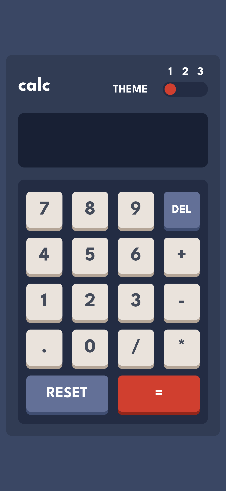
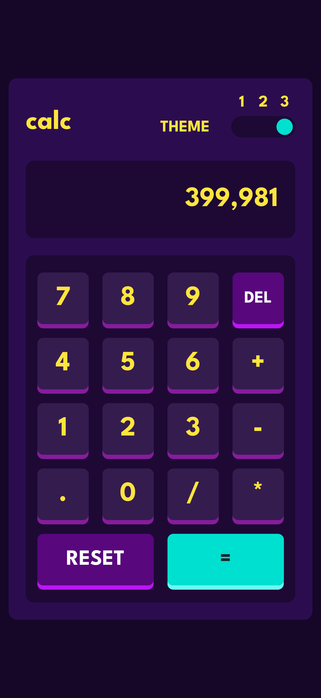

# Frontend Mentor - Calculator app solution

This is a solution to the [Calculator app challenge on Frontend Mentor](https://www.frontendmentor.io/challenges/calculator-app-9lteq5N29). Frontend Mentor challenges help you improve your coding skills by building realistic projects. 

## Table of contents

- [Overview](#overview)
  - [The challenge](#the-challenge)
  - [Screenshot](#screenshot)
  - [Links](#links)
- [My process](#my-process)
  - [Built with](#built-with)
  - [Useful resources](#useful-resources)
- [Author](#author)

**Note: Delete this note and update the table of contents based on what sections you keep.**

## Overview

### The challenge

Users should be able to:

- See the size of the elements adjust based on their device's screen size
- Perform mathmatical operations like addition, subtraction, multiplication, and division
- Adjust the color theme based on their preference
- **Bonus**: Have their initial theme preference checked using `prefers-color-scheme` and have any additional changes saved in the browser

### Screenshot

### Screenshot

  

    
    
  

### Links

- Solution URL: [https://github.com/Guille-Sanchez/calculator](https://github.com/Guille-Sanchez/calculator)
- Live Site URL: [https://calculator-app-chichodev.netlify.app/](https://calculator-app-chichodev.netlify.app/)

## My process

### Built with

- Semantic HTML5 markup
- CSS custom properties
- Flexbox
- CSS Grid
- Mobile-first workflow
- LocalStorage
- Redux
- [React](https://reactjs.org/) - JS library
- TypeScript

### Useful resources

- [Toggle theme button](https://www.w3schools.com/howto/howto_css_custom_checkbox.asp) - This resource helped me create the toggle theme button at the top of the calculator.

## Author

- Website - [My Porfolio](https://guillermo-portfolio.netlify.app/)
- Frontend Mentor - [@Guille-Sanchez](https://www.frontendmentor.io/profile/Guille-Sanchez)
- LinkedIn - [Guillermo Sanchez](https://www.linkedin.com/in/guillermo-sanchez-developer/)